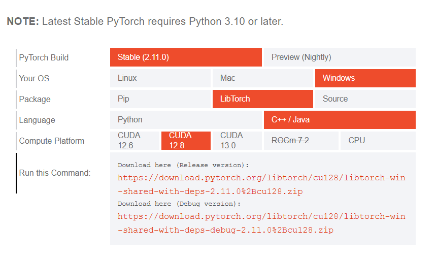
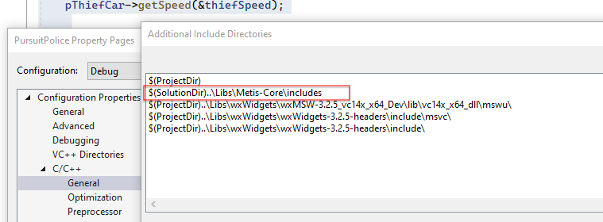
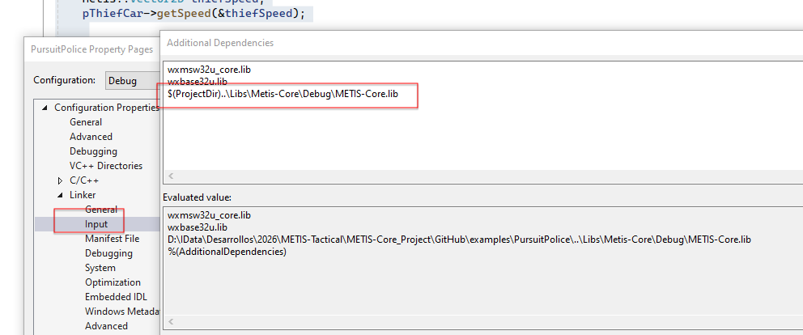

# 🛠 METIS-Core: Installation & Build Guide

This guide provides the necessary steps to configure your environment and compile the **METIS-Core** framework and its example suite.

## 1. System Requirements

*   **Operating System:** Windows 10/11 (x64).
*   **Compiler:** Visual Studio 2022 (with **Desktop Development with C++** workload installed).
*   **Architecture:** x64 (Release configuration is highly recommended for performance).

## 2. Steps to download the dependencies

### **Step 1: Download the LibTorch library (PyTorch C++)**
The LibTorch frontend is **mandatory** for the core functionality of METIS. You can download the binaries from the official link:
[https://pytorch.org/get-started/locally/](https://pytorch.org/get-started/locally/)

**Recommended Versions:**
* **PyTorch Debug:** 2.10.0+cu128
* **PyTorch Release:** 2.7.0+cu128

Although you only need the LibTorch DLLs to run METIS-Core, you can download the necessary runtime files from this link:
http://www.mapjobs.es/Metis-Core/pyTorch_v2.10.0_cu128_dlls_debug.zip
http://www.mapjobs.es/Metis-Core/pyTorch_v2.07.0_cu128_dlls_release.zip
(GitHub not allows to upload big files)

---

### **Step 2: Download wxWidgets**
This library is **required** to run the graphical examples (such as PursuitPolice). You have two options:

1. **Manual Installation:** Follow the official guide at [https://docs.wxwidgets.org/3.2.10/overview_install.html](https://docs.wxwidgets.org/3.2.10/overview_install.html)
2. **Pre-compiled Binaries (Recommended):** Download the **wxWidgets v3.2.5** package, which includes already compiled headers (.h), libraries (.lib), and DLLs (.dll):
[Download wxWidgets_v3.2.5.zip](https://github.com/felixromo314/METIS-Core/releases/download/Dependencies-wxWidgets_v3.2.5/wxWidgets_v3.2.5.zip)

The final structure of the folder should be this:

Examples/
├── Libs/
│   ├── METIS-Core/
│   │   ├── includes/
│   │   ├── Debug/
│   │   └── Release/
│   ├── Torch/
│   │   ├── libtorchCUDA/
│   │   └── libtorchDebugCUDA/
│   └── wxWidgets/
│       ├── wxMSW-3.2.5_vc14x_x64_Dev/
│       └── wxWidgets-3.2.5-headers/
├── PursuitPolice/ (Example: Police unit tracking a non-compliant vehicle)
└── (Other examples: MARL, AlphaZero-style games, etc.)

This structure allows all C++ example projects to share a centralized set of libraries (METIS-Core, LibTorch, and wxWidgets), ensuring consistency across the environment and simplifying dependency management.

## 3. Environment Configuration

The project PursuitPolice is already configured to search the libraries and incluides in the directory "Libs/"

Configure the includes:

Configure the libraries:

Note: Although METIS-Core is built on PyTorch, it handles the integration internally. As a result, you do not need the PyTorch headers (.h) or static libraries (.lib) to run the framework. You only need to ensure that the PyTorch DLLs are located in the same directory as your executable (.exe).

## 4. Run the Examples/

1.  Open the solution file `PursuitPolice.sln` in Visual Studio 2022.
2.  Check that the path of the includes and libraries are correct.
<youdirectory>\examples\Libs\Metis-Core
<youdirectory>\examples\examples\Libs\Torch\libtorchCUDA
<youdirectory>\examples\examples\Libs\Torch\libtorchDebugCUDA   
<youdirectory>\examples\Libs\wxWidgets\wxMSW-3.2.5_vc14x_x64_Dev
<youdirectory>\examples\Libs\wxWidgets\wxWidgets-3.2.5-headers

And copy all the .dlls of the wxWidgets and pytorch in the Output Directory of the proyect:
<youdirectory>\examples\PursuitPolice\x64\Debug

