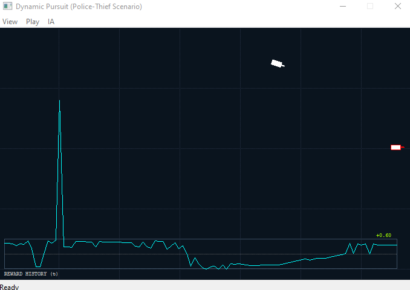

# METIS-Core: High-Performance C++ Reinforcement Learning Framework

### *Generalized Decision-Making Engine for Autonomous Agents*

**METIS-Core** is a professional-grade, pure **C++ framework** designed for **Deep Reinforcement Learning (DRL)** and **Multi-Agent Reinforcement Learning (MARL)**. It provides a robust architecture for training autonomous entities in complex, high-stakes environments where performance and low latency are critical.

Unlike Python-based alternatives, **METIS-Core** is engineered for production-ready systems, offering a generic interface to solve optimization, navigation, and strategic problems across diverse industries.

---

### ⚡ Designed for Performance

*   **Zero Python overhead:** Maximum execution speed for real-time systems.
*   **Native LibTorch integration:** Leveraging the PyTorch C++ API for seamless inference and training.

---

### 🚀 Key Pillars

*   **Mathematical Abstraction:** Agents operate on pure Tensor-based states, decoupling intelligence from the specific application context.
*   **Industry Agnostic:** Built to power autonomous logic in Finance (Trading), Robotics, Logistics, and Behavioral AI.
*   **Scalability:** Designed to handle complex multi-agent coordination with high-fidelity simulation requirements.

---

## 🚀 Roadmap & Intended Capabilities

**METIS-Core** is being developed to bridge the gap between advanced Reinforcement Learning research and production-ready autonomous systems. Our goal is to provide a standardized, high-performance RL interface for:

*   **Multi-Agent Coordination:** A unified C++ API designed to synchronize behavior across heterogeneous fleets (e.g., logistics robots, sensor networks, and autonomous transport systems).
*   **Self-Play Framework:** Enabling AlphaZero-style training loops for agents to discover and evolve optimal strategic behaviors through competitive self-simulation and iterative learning.
*   **Strategic MARL:** Specialized Multi-Agent Reinforcement Learning algorithms for complex collaborative tasks such as swarm intelligence, distributed resource management, and cooperative navigation.
*   **Predictive Kinematics:** Native C++ implementations of advanced trajectory prediction and geometry for high-precision tasks, including autonomous docking, object tracking, and dynamic obstacle avoidance.

---

## 🛠 Architecture & Integration

METIS-Core is delivered as a **High-Performance SDK**, allowing developers to integrate advanced AI into proprietary simulators without exposing their core logic or sacrificing millisecond-level latency.

### Repository Structure
*   ` /Release ` : .zip of Metis-Core in release with binaries, libraries and includes
*   ` /Debug ` : .zip of Metis-Core in debug with binaries, libraries and includes
*   ` /examples ` : Full Source Code for various scenarios (Pursuit, Collaborative Navigation, etc.).
*   ` /tutorial ` : tutorial step by step to use Metis.
*   ` /docs ` : Technical manuals and API reference.

---

## 📊 Core Visualization (Screenshots)

### 1. Dynamic Pursuit Logic


*Figure 1: Agent calculating optimal trajectory to reach a moving target using METIS-Core.*

https://github.com/felixromo314/METIS-Core/blob/main/videos/PursuitPolice.mp4

*Figure 1: Agent calculating optimal trajectory to reach a moving target using METIS-Core.*

### 3. Self-Play (AlphaGo Zero) [Implemented to be added]

---

### 📢 Latest Version: v0.1 (Alpha) - Current Features

The current build includes the foundational architecture for autonomous decision-making:

*   **DQN Core Module:** Enables autonomous objective-reaching capabilities. Ideal for training agents in complex navigation, point-to-point pathfinding, and strategic behavioral logic (e.g., `examples/PursuitPolice`).

---

---

## ⏱ Quick Start (3 Minutes)

Integrating METIS into your C++ project is straightforward:

1. **Include headers:**
```cpp
#include "MetisCore.h"

// Create your own particular Agent
class Car :public Metis::Agent
{
	// override from Metis-Core
	virtual int getActionProcedural(Metis::State& state);
	virtual int update(double delta_time);
}

// Create your own particular Enviroment
class UrbanEnvironment : public Metis::Enviroment
{

	// override from Metis-Core
	virtual float calculateReward(Metis::State& state,int *pDone);
	virtual void getState(Metis::State* pState);
	virtual void serializeState(void* state, std::vector<float>* stateVector);
	virtual void applyAction(Metis::IAgent* pAgent,int actionId);
	virtual bool isEpisodeDone();
}

MyView::MyView(wxFrame* parent)
    : wxPanel(parent) {

    
    _pUrbanEnv = new UrbanEnvironment();
    
    _policeCar = new Car();
    _thiefCar = new Car();
	_policeCar->setID(0);
	_thiefCar->setID(1);
	
	_policeCar->createBrain(NUM_INPUTS, NUM_ACTIONS); // create DQN network

	_pUrbanEnv->addAgent(_policeCar);
	_pUrbanEnv->addAgent(_thiefCar);
	
	

}
// Start training
void MyView::StartPursuitTraining()
{
    Metis::AgentTrainerDQN agentTrainer;  // create DQN algorithm trainer
    _doTraining = true; // Corregido: training
    agentTrainer.setCallbackPerStep(onStepTraining);
    agentTrainer.setCallbackEndEpisode(onEndEpisode);
    agentTrainer.training(_pUrbanEnv, _policeCar, _thiefCar);  // do the training
}