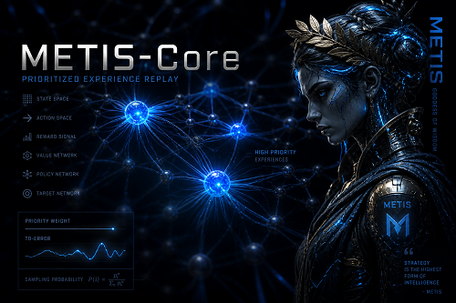
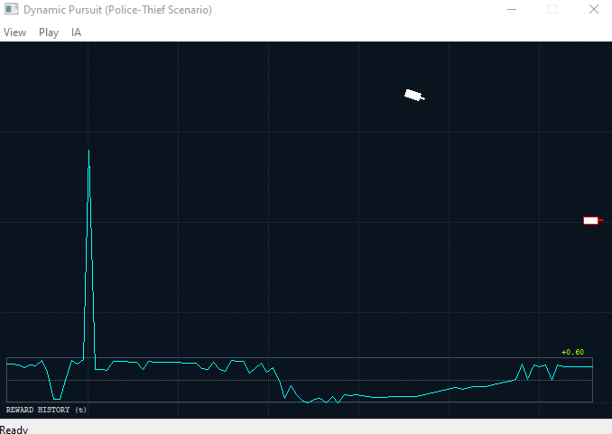
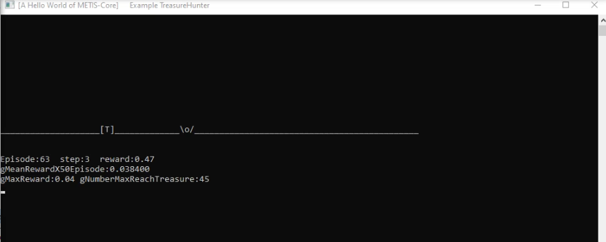

# METIS-Core: A C++ Reinforcement Learning Framework

### *Generalized Decision-Making Engine for Autonomous Agents*

**METIS-Core** is a professional-grade, pure **C++ framework** designed for **Deep Reinforcement Learning (DRL)** and **Multi-Agent Reinforcement Learning (MARL)**. It provides a robust architecture for training autonomous entities in complex, high-stakes environments where performance and low latency are critical.

Unlike Python-based alternatives, **METIS-Core** is engineered for production-ready systems, offering a generic interface to solve optimization, navigation, and strategic problems across diverse industries.

---

### ⚡ Designed for Performance

*   **Zero Python overhead:** Maximum execution speed for real-time systems.
*   **Native LibTorch integration:** Leveraging the PyTorch C++ API for seamless inference and training.

---

### 🚀 Key Pillars

*   **Mathematical Abstraction:** Agents operate on pure Tensor-based states, decoupling intelligence from the specific application context.
*   **Industry Agnostic:** Built to power autonomous logic in Finance (Trading), Robotics, Logistics, and Behavioral AI.

---

## 🛠️ Current Status & News

*   **Last Update:**  18 September 2026 **
	Current Development Roadmap:
	
	Next:
	* **AlphaZero Go** Asimetric:AlphaZero Go Asymmetric (MARL): Merging our Multi-Head neural networks with MCTS for complex Multi-Agent scenarios. Metis-Core will supports training entities with completely different action spaces and objectives (e.g., 1 Frigate (CWIS) vs 2 Kamikaze Drones).
	
	* **PPO (Proximal Policy Optimization):** Enabling support for **continuous action spaces**. This allows METIS-Core to output precise, multi-dimensional values, making it ideal for fields requiring fluid control and high-precision decision making.

*   🚀 **v0.3.1-alpha Released**: 
		* **AlphaZero Go:** Training in multi-threading the AlphaZero:

*   🚀 **v0.3.0-alpha Released**: 
      * **AlphaZero Go:** AlphaZero Engine & Self-Play: Successfully integrated the AlphaZero self-play and MCTS loop using LibTorch. Validated on Los Alamos Chess (6x6) as a reference environment to balance tactical complexity with local hardware training efficiency. Paper: Mastering Chess and Shogi by Self-Play with a General Reinforcement Learning Algorithm by DeepMind.
		
	
	> **Note:** Best experienced with audio! The video features a custom soundtrack composed for the Metis-Core project.	

*   🚀 **v0.2.0-alpha Released**: 
	*   **Added Multi-head Architectures**: shared-backbone system to support coordination among AI agents to reach a shared goal
	*	**Added "SwarmDefenseTIE" example**: A collaborative MARL scenario where an Imperial Shuttle and two TIE fighters must transport beskar to the Death Star. All agents are trained with a Shared-Trunk Multi-Head architecture to develop defensive coordination against an attacking X-Wing.

	
	> **Note:** Best experienced with audio! The video features a custom soundtrack composed for the Metis-Core project.

			
*   🚀 **v0.1.2-alpha Released**: 
    *   **Added "Treasure Hunter"**: A minimalist "Hello World" in a single `.cpp` file for quick onboarding.
    *   **Added "PursuitPolice"**: A dynamic environment where a DQN-controlled police agent learns to intercept a fleeing target.
*   📱 **Future Target: Integrating MCTS (Monte Carlo Tree Search) and dual-head networks to master complex strategic games. 

---

## 🛠 Architecture & Integration

METIS-Core is delivered with a .lib, .dll and .h.

### Repository Structure
*   ` /Release ` : .zip of Metis-Core in release with binaries, libraries and includes
*   ` /examples ` : Full Source Code for various scenarios (Pursuit, Collaborative Navigation, etc.).
*   ` /tutorial ` : tutorial step by step to use Metis-Core.

---

## 📊 Core Visualization (Screenshots)

### 1. Dynamic Pursuit Logic

*Figure 1: Agent calculating optimal trajectory to reach a moving target using METIS-Core.*

https://github.com/felixromo314/METIS-Core/blob/main/videos/PursuitPolice.mp4

*Figure 1: Agent calculating optimal trajectory to reach a moving target using METIS-Core.*

### 3. Self-Play (AlphaGo Zero) [Implemented to be added]

---

### 📢 Latest Version: v0.1.2 (Alpha) - Current Features

The current build includes the foundational architecture for autonomous decision-making:

*   **DQN Core Module:** Enables autonomous objective-reaching capabilities. Ideal for training agents in complex navigation, point-to-point pathfinding, and strategic behavioral logic (e.g., `examples/PursuitPolice`).

---

## ⏱ Get Started: Hello World

The best way to understand **METIS-Core** is through our "Hello World" example. This standalone implementation (all the code in one .cpp) demonstrates a complete Reinforcement Learning cycle in a minimalist 1D environment.

### [HelloWorld_TreasureHunter.cpp](./examples/HelloWorld_TreasureHunter/HelloWorld_TreasureHunter.cpp)

In this example, you will learn:
* **Environment Setup**: How to inherit from `Metis::Environment` to create your own world.
* **State Representation**: Using `TTREASURESTATE` to feed spatial data to the agent.
* **Reward Engineering**: Implementation of a *Step Penalty* to optimize agent efficiency and prevent "infinite loops" or indecisive behavior.
* **Agent Training**: Loading and saving the `.ia` model files for persistent learning.

#### 🎮 How to run it:
1. Open the project in **Visual Studio**.
2. Build the solution (ensure the METIS DLLs are in your path).
3. Run the executable and choose:
   - **Option 1**: To see the agent learn from scratch (watch the `trainingLog.txt`).
   - **Option 2**: To watch the pre-trained agent reach the treasure instantly from any random position.

> **Note**: This file is self-contained and heavily commented, making it the perfect starting point for developers new to the framework.

---