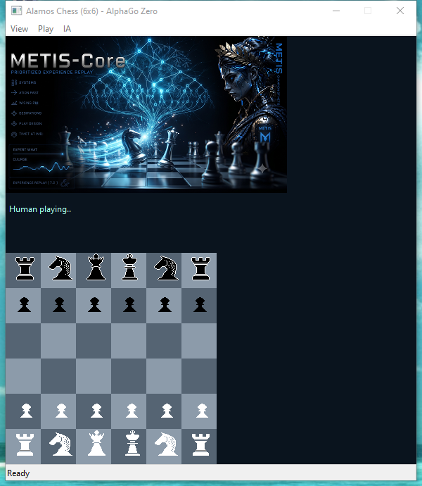

# Tutorial: How to Use AlphaGo Zero with Metis-Core  (METIS-Core v0.3.0  alpha)

##  Introduction to AlphaGo Zero

# AlphaGo Zero

**AlphaGo Zero** is a **self-play** reinforcement learning algorithm where **an agent plays against itself**. While **the rules of the game are fully implemented**, it starts with **zero human domain knowledge**, learning entirely from scratch as it plays.

## Core Principles of the Learning Process

* **Single-Agent Self-Play:** A single agent plays against itself, utilizing and updating a single deep neural network.
* **MCTS-Guided Move Selection:** Moves are selected using **Monte Carlo Tree Search (MCTS)**. The neural network evaluates each node (predicting move probabilities and win rates), guiding the MCTS on which branches to explore.
* **Episode End & Experience Buffer:** At the end of an episode, the game's outcome (+1 for a win, -1 for a loss) is determined. This final reward is assigned to all moves executed during that episode. The data (game states, MCTS search probabilities, and final outcomes) is stored in an **experience replay buffer** used to train the network.
* **Closed Feedback Loop:** A closed feedback loop is established: 
  * The neural network guides the MCTS to search more efficiently.
  * The MCTS search generates higher-quality training data to improve the neural network's predictions over time.

# Tutorial: Implementing AlphaGo Zero in Metis-Core

## Alamos Chess
To demonstrate how to build and train a AlphaGo Zero using Metis-Core, I have implemented the "Alamos chess" example.



Why 'Alamos Chess' (6x6 board)? It is a reduced version of standard chess, but it still possesses enough complexity for an AI chess agent to learn tactics and strategies.

### Demo: Alamos Chess

Check out the ia chess learnign and in action! 🚀

[](https://www.youtube.com/watch?v=Fswef8e0Okc)

> **Note:** Best experienced with audio! The video features a custom soundtrack composed for the Metis-Core project.

- **Video Link:** [https://youtu.be/Fswef8e0Okc](https://youtu.be/Fswef8e0Okc)

# Main Classes in Metis-Core

Metis-Core is completely environment-agnostic. You can easily integrate your own simulation by inheriting from our base classes and overriding the required methods to define your environment's state.
The main class to implemented the AlphaGo Zero are:

### template <typename TSTATE,typename TACTION> class IAlphaGoZeroState : public IAlphaGoZeroStateBase

It is the class that we have to derivete our own class where we are going to implemented our own enviroment, in this case, the Board of the chess.
```cpp
class Board : public Metis::IAlphaGoZeroState<TBOARD,TPIECEMOVEMENT>
```
The methods that we have to override are:
```cpp
//-------------------------------------------------------------------------------
// override from Metis Core
// 1. getMaterialHeuristicValue
// Generic: Returns an optional heuristic evaluation score for the current state, bounded between -1.0 and 1.0.
// Alamos Chess: Evaluates the 6x6 board by counting piece values (Pawns, Knights, Rooks, Queen, King) to provide a quick material advantage score for the specified player.
virtual float getMaterialHeuristicValue(int playerToEvaluateID);

// 2. isStateRelativeToPlayer
// Generic: Indicates whether the state representation is flipped or oriented relative to the currently active player.
// Alamos Chess: Returns whether the 6x6 board view is rotated so that the current player's pieces are always perceived from the bottom perspective.
virtual bool isStateRelativeToPlayer();

// 3. getNumInputs
// Generic: Defines the total dimension size of the feature vector required as input by the neural network.
// Alamos Chess: Corresponds to the total flat size of the 6x6 board tensor representation (piece channels, game states, etc.).
virtual int getNumInputs();

// 4. getNumActions
// Generic: Returns the total discrete action space size available across the entire environment.
// Alamos Chess: Represents the maximum size of the policy output vector (e.g., 36 source squares x 36 destination squares = 1296 possible actions).
virtual int getNumActions();

// 5. isTerminal
// Generic: Checks whether the current state represents an end-of-episode or terminal condition.
// Alamos Chess: Checks if a checkmate, stalemate, or draw condition has been reached on the 6x6 board.
virtual bool isTerminal();

// 6. getReward
// Generic: Retrieves the numerical reward outcome for a specific player at the end of an episode.
// Alamos Chess: Returns +1.0 for a win, -1.0 for a loss, and 0.0 for a draw from the perspective of that player.
virtual double getReward(int playerID);

// 7. getWinner
// Generic: Identifies which player won the game once a terminal state is reached.
// Alamos Chess: Returns the ID of the victorious player (White or Black) or indicates a tie.
virtual int getWinner();

// 8. applyAction
// Generic: Executes a given action, mutating the environment's internal state to transition to the next step.
// Alamos Chess: Moves a piece on the 6x6 board according to the chosen action, updating piece positions and game states.
virtual void applyAction(int action);

// 9. getPossibleActions
// Generic: Populates a collection with all valid, legal actions available for a specific player in the current state.
// Alamos Chess: Generates all legal chess moves for the active player's pieces on the 6x6 grid, filtering out illegal movements.
// Note: TACTION must implement a toIndex(int playerID) method to map the move to a flat integer index for the neural network's policy vector.
// If playerID != -1, actions are calculated from that specific player's perspective.
virtual void getPossibleActions(int playerID, std::vector<TACTION>& actions);

// 10. getCurrentPlayerID
// Generic: Returns the identifier of the player whose turn it is to act.
// Alamos Chess: Returns whether it is currently White's turn or Black's turn to move.
virtual int getCurrentPlayerID();

// 11. reset
// Generic: Resets the environment back to its initial starting configuration to begin a fresh episode.
// Alamos Chess: Reinitializes the 6x6 board layout back to the standard starting position with all pieces in place.
virtual void reset(int typeReset);

// 12. update
// Generic: Updates internal time-dependent dynamics or physics of the environment if applicable.
// Alamos Chess: Typically a no-op since turn-based board games do not rely on continuous time physics.
virtual void update(float incTime = 0.01);

// 13. clone
// Generic: Creates an exact deep copy of the current state object, essential for tree search simulations.
// Alamos Chess: Duplicates the entire 6x6 board configuration and piece arrays so the MCTS can safely simulate future lines without affecting the main game.
virtual IAlphaGoZeroStateBase* clone();

// 14. getState
// Generic: Serializes the current environment state into a flat array of floating-point values.
// Alamos Chess: Converts the 6x6 board matrix and metadata into the flat feature vector expected by the LibTorch neural network.
virtual std::vector<float> getState();

// 15. is_valid_action
// Generic: Verifies whether a specific action index is legally permissible in the current state.
// Alamos Chess: Checks if a specific move adheres strictly to the movement rules of the piece on the 6x6 board.
virtual bool is_valid_action(int actionID);

// 16. getRandomActionFromPlayer
// Generic: Selects a random legal action from the pool of valid options for the active player.
// Alamos Chess: Picks a random legal chess move from all possible valid moves available to the current player.
virtual int getRandomActionFromPlayer(int currentPlayer);
//-------------------------------------------------------------------------------
```

### class Metis::IAgent

This class represent the player.

```cpp
class Player : public Metis::IAgent
```

there is no need to override methods of this class.


### class Metis::AlphaGoZeroTrainer

It is the class which implement inside the AlphaGo Zero algorithm.

the main method is:

```cpp
void training(IAlphaGoZeroState<TSTATE,TACTION>* pEnv, IAgent* pAgent, IAgent* pEnemyAgent,bool bUseGPU)
```
It is a template method where should be call with a struct that represent the state of the enviroment, and the TACTION it is a struct that represent the action.

note: TSTATE is not use at the end in the algorithm
TACTION in our example is:

```cpp
typedef struct stPieceMovement
{
	unsigned long movementID;
	Figure figure;
	int oldX;
	int oldY;
	int newX;
	int newY;

	int toIndex(int currentPlayer) const  // MUST BE IMPLEMENTED
	{
		.....
		.......
		return (fromSquare * NUM_SQUARES) + toSquare;
	}
}TPIECEMOVEMENT;
```

toIndex: is a method used by Metis-Core to translate the representation of a move from (oldX, oldY) to (newX, newY) into a unique index number. This index number represents the move inside Metis-Core.

How to call the AlphaZero-Go algorithm in Metis-Core?

```cpp
_AGZTrainer = MY_NEW Metis::AlphaGoZeroTrainer();
...
..
_AGZTrainer->training<TBOARD,TPIECEMOVEMENT>(_pBoard, _pWhites, _pBlacks, bIsPresent_GPU);
```

In order to help to the AlphaGo Zero to learn faster, you can use a heuristic using the method "setMaterialHeuristicWeight".
```cpp
void AlphaGoZeroTrainer::setMaterialHeuristicWeight(double weight)
```
If you use setMaterialHeuristicWeight, the Metis-core engine will internally call the method virtual float getMaterialHeuristicValue(int playerToEvaluateID). In the Los Alamos chess example, this method returns a float between -1.0 and +1.0 from the perspective of the evaluated player. A value of +1.0 indicates a winning advantage for that player, while -1.0 represents a worst-case scenario.

Internally, the board position is then evaluated using this formula:

Board_Evaluation = (NeuralNet_Value * NN_Weight) + (Material_Value * Material_Weight)

Injecting this material heuristic acts as a guide, helping the network learn much faster during its early stages.

However, if you do not call setMaterialHeuristicWeight, the engine will behave as a pure AlphaZero algorithm, relying entirely on the neural network's evaluations without any hardcoded human heuristics.


