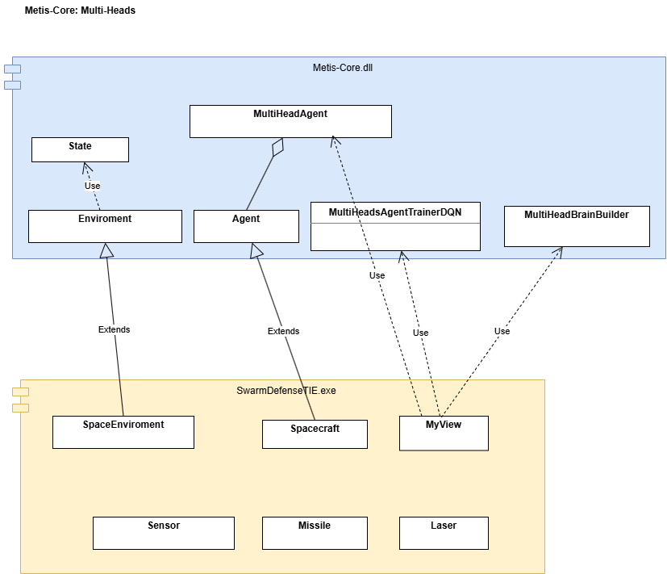

# Tutorial: How to Use Multi-Head Networks with Metis-Core  (METIS-Core v0.2.0  alpha)

## Introduction: What is a Multi-Head Architecture in Reinforcement Learning?

In traditional reinforcement learning (such as a standard DQN), the neural network takes a state vector as input and outputs a single value or action. But what happens when your agent needs to perform **several distinct tasks simultaneously**? 

Furthermore, what if you want **multiple agents to collaborate** to achieve a shared goal? A Multi-Head architecture—where a centralized network processes the environment and branches out into multiple "heads" to dictate simultaneous, independent actions—is a powerful solution. This approach avoids combinatorial explosion and can be applied to vastly different fields:

* **Search & Rescue, Drone Swarms, and Warehouse Automation**
  Imagine training two Imperial TIE Fighters that must escort an Imperial Shuttle traveling from Planet A to the Death Star. The fighters must collaborate seamlessly—maintaining their formation while simultaneously making independent decisions to break off and fire if a Rebel X-Wing gets too close.

* **Datacenter Energy Optimization**
  AI agents collaborate to keep server racks cool while minimizing electricity costs. For example, one head of the network might control the HVAC cooling output, another routes network traffic away from overheating servers, and a third puts idle hard drives into sleep mode. They all work together to balance temperature and power usage in real-time.

* **Video Game "AI Directors"**
  Similar to the dynamic difficulty system used in games like *Left 4 Dead*, a Multi-Head network can control the pacing of a game. One head manages enemy spawn rates, another controls loot drops (like ammo and health), and a third adjusts the background music to match the current tension level.

* **Quantitative Trading Bots**
  As demonstrated in academic research like *"DeepScalper: A Risk-Aware Reinforcement Learning Framework to Capture Fleeting Intraday Trading Opportunities"*, a network can use multiple heads to simultaneously decide the trading direction (buy/sell), the position size (how much capital to risk), and the pricing aggressiveness in high-frequency trading.


# Tutorial: Implementing Multi-Head Networks in Metis-Core

## The Imperial Swarm Defense Scenario
To demonstrate how to build and train a Multi-Head neural network using Metis-Core, I have implemented the "Imperial Swarm Defense" example.

**The Mission Context:**
An Imperial Shuttle, carrying a critical shipment of Beskar steel destined for the Death Star, is under fire. A Rebel X-Wings (human in the loop or procedural bot) has intercepted the route, determined to prevent the shuttle from reaching its destination. 

In this scenario, the Imperial Shuttle and its two escorting TIE Fighters learn to collaborate using a Multi-Head architecture. The agents must work in unison to reach the Death Star while effectively defending themselves against incoming Rebel X-Wing attacks.

This scenario serves as the perfect testbed for Multi-Head architectures, as the fighters must balance navigation and formation maintenance (modeled as **dense shaping rewards**) alongside time-critical tactical actions such as firing lasers or deploying decoys (modeled as **event-based rewards**).

### Demo: SwarmDefenseTIE

Check out the swarm coordination in action! 🚀

[](https://www.youtube.com/watch?v=Fswef8e0Okc)

> **Note:** Best experienced with audio! The video features a custom soundtrack composed for the Metis-Core project.

- **Video Link:** [https://youtu.be/Fswef8e0Okc](https://youtu.be/Fswef8e0Okc)


# Main Classes in Metis-Core

Metis-Core is completely environment-agnostic. You can easily integrate your own simulation by inheriting from our base classes and overriding the required methods to define your environment's state and reward functions.



### Class `Environment`

The `Environment` class represents the simulated world where the AI agents learn. To integrate your own simulation, you must override the following pure virtual functions:

* `virtual void reset() = 0;`
  Resets the environment state at the start of each training episode.

* `virtual void getState(State* pState) = 0;`
  Fills `pState` with current environment data. This data is utilized for Replay Buffer storage.
  The size of the struct State should not be more than 1000 bytes.

* `virtual void serializeState(void* state, std::vector<float>* stateVector) = 0;`
  Serializes environment data into a flat vector. This vector serves as the input for the neural network.

* `virtual void applyAction(IAgent* pAgent, int actionId) = 0;`
  Executes the selected action for the specified agent.

* `virtual float calculateReward(State& state, int* iDone) = 0;`
  Calculates the reward for standard DQN models. 
  * `int* iDone`: [out] Pointer to set the episode termination status.
  * ` 1`: Terminal state (Success / Objective reached).
  * `-1`: Terminal state (Failure / Agent destroyed or penalty condition).
  * ` 0`: Non-terminal state (Episode is ongoing).
  *Note: Override this only if using standard DQN; keep it empty for Multi-Head implementations.*

* `virtual std::vector<TMULTIHEAD> calculateRewards(State& state, int* iDone) = 0;`
  Calculates rewards for Multi-Head architectures. Returns a vector of rewards, providing one value per action branch (head).
  
  
Future work: getState and serializeState seem to do the same work. Thiking of refactoring for being more simple.
  
### Class `Agent`

The `Agent` class represents the AI entity being trained by the framework. To customize your agent's behavior, override the following methods:

* `virtual int getActionProcedural(Metis::State& state);`
  Used for sparring agents (opponents). Implement your heuristic or rule-based logic here to train your AI against a non-learning competitor.

* `virtual void update(double delta_time);`
  Core loop update. Use this to handle internal logic such as physics simulation, sensor data acquisition, or networking.

* `virtual bool isValidAction(int iAction)`
  Action filter for Multi-Head architectures. 
  Since different heads may have specific roles or constraints, use this to restrict which actions are permitted for the current state/agent. Returns `true` by default.

* `virtual bool isValidAction(int iAction) { return true; };`

### Class `MultiHeadAgent`

The `MultiHeadAgent` class represent the a group of ia agents (class `Agent`) that colaborate to get a aim.

Note that `MultiHeadAgent` acts as a container—or "orchestrator"—that manages a collection of these `Agent` objects. Therefore, the specialized behavior for each branch or role must be encapsulated within your custom `Agent` implementation.

### Class `MultiHeadBrainBuilder`

The `MultiHeadBrainBuilder` implements the **Builder Pattern** to provide a fluent interface for configuring and instantiating `MultiHeadAgent` objects.

Example:
```cpp
_pMultiAgentHead = multiBuilderHeads.addHead("Shuttle", _Shuttle)
                                    .addHead("TIE_1", _fighter_TIE_1)
                                    .addHead("TIE_2", _fighter_TIE_2)
                                    .setNumberInputsOutputs(CONVOY_INPUTS, ACTIONS::MAX_ACTIONS)
                                    .useGPU(bUseGPU)
                                    .build();
```

** Multi-Head Neural Architecture

* **Multi-Head Configuration:** This builder instantiates a deep neural network with three distinct heads.
* **Input/Output Mapping:** The network processes `CONVOY_INPUTS` and outputs `ACTIONS::MAX_ACTIONS` for each head.
* **Role Filtering:** To enforce specific logic per agent, you must override `Agent::isValidAction(int iAction)`. This allows the framework to dynamically mask or validate actions according to the role and constraints of each specific agent head. Metis-core assign the same number of action to each head.

_Shuttle, _Shuttle and _fighter_TIE_2 are object derivid from the class Agent.


### Class `MultiHeadsAgentTrainerDQN`

This class implements the training orchestration for `MultiHeadAgent` objects.

#### Implementation Details
* **Algorithm:** Multi-Head Deep Q-Network (DQN).
* **Experience Replay:** Uses a Prioritized Experience Replay (PER) buffer.
* **Training Specs:** * **Batch Size:** 64 (hardcoded; TODO: migration to configurable property).
  * **Compute Backend:** Supports CPU/GPU execution, configured via `MultiHeadBrainBuilder::useGPU(bool)`.
  
* **GPU Detection:** You can use the following function to query hardware availability at runtime:
```cpp
  bool bUseGPU = Metis::isCUDAavailable();
```

---
***
___

# Main clases in SwarmDefenseTIE

Context of the app SwarmDefenseTIE:
An Imperial Shuttle, carrying a critical shipment of Beskar steel destined for the Death Star, is under fire. A Rebel X-Wings (human in the loop or procedural bot) has intercepted the route, determined to prevent the shuttle from reaching its destination. 

Now, we are going to explain the classes of the example SwarmDefenseTIE to be more educational how to use in Metis-Core the multi-head nets.

### Class `SpaceEnviroment`

```cpp
class SpaceEnviroment : public Metis::Enviroment
```

The `SpaceEnvironment` class implements the simulation logic for the *SwarmDefenseTIE* scenario, acting as the interface between the game physics and the `Metis-Core` framework.


To adapt the framework to the specific requirements of the *SwarmDefense* mission, the following methods from the base `Environment` class have been overridden:

```cpp
virtual void reset();
```
Resets the TIE fighter and Shuttle positions, clears active projectiles, and resets the simulation clock.
Is called each time that a new episode start.

```cpp
virtual float calculateReward(Metis::State& state, int* pDone) { return 0.0; };
```
Used exclusively for standard DQN architectures. 
  > **Note:** In Multi-Head configurations, this function is bypassed. It should return `0.0f` as the reward logic is handled independently by the `calculateRewards()` method.

```cpp
virtual std::vector<Metis::TMULTIHEAD> calculateRewards(Metis::State& state, int* pDone);
```

Calculates independent reward signals for each head. This enables the Multi-Head architecture to optimize for individual agent tasks (navigation, defense, and engagement) simultaneously.

```cpp
virtual std::vector<Metis::TMULTIHEAD> calculateRewards(Metis::State& state, int* pDone)
{
vector<Metis::TMULTIHEAD> rewards;
...
r_Shuttle.reward = calculate_rewardShuttle(pSpaceEnv);
r_X_TIE_1.reward = calculate_reward_X_TIE1(pSpaceEnv);
r_X_TIE_2.reward = calculate_reward_X_TIE2(pSpaceEnv);

if (posMerchantRelativToTarget.magnitude() < MIN_DISTANCE_TO_TARGET_POSITION)
	*pDone = -1; // in case shuttle is not scorted by the two x-wings
if ( (fabs(posShuttle.x) > SpaceEnviroment::_maxSIZE_X) ||
	 (fabs(posShuttle.y) > SpaceEnviroment::_maxSIZE_Y) )
{
	*pDone = -1; // out of the world
	r_Shuttle.reward -= 5.0;
}	
...
rewards.push_back(r_Shuttle);
rewards.push_back(r_X_TIE_1);
rewards.push_back(r_X_TIE_2);
return rewards;
}
```

```cpp
virtual void setNumActions(int numActions) {};
```
Used exclusively for standard DQN architectures. 

```cpp
virtual void getState(Metis::State* pState);
```
Fills `pState` with current environment data. This data is utilized for Replay Buffer storage.

It is important to note that `SpaceEnvironment` utilizes the `TSPACEENVIROMENT` struct to encapsulate the environment's state at each time step. 
This data structure is critical for two reasons:
1. **Experience Replay:** It serves as the data packet stored in the `Experience Replay Buffer`.
2. **Prioritized Sampling:** The framework’s `Prioritized Replay Buffer` accesses this structure to retrieve and sample experiences during the training phase.

```cpp
//data about all the agents in the enviroment
typedef struct _join_state
{
	TOBS_TIE _escortTIEs[MAX_ESCORT_TIES];
	Metis::Vector2D _scortRelativPositionX_TIE1; // 2 fields
	Metis::Vector2D _scortRelativPositionX_TIE2; // 2 fields
	TOBS_XWING _X_Wing_figther; // 8 inputs
	int currentStep; // to measure the time passed
}TSPACEENVIROMENT;

virtual void getState(Metis::State* pState)
{

	TSPACEENVIROMENT spaceEnv;
	
	spaceEnv.currentStep = this->_currenteStep;
	..................
	// filled the fields of spaceEnv
	..............................
	
	pState->copyState(&spaceEnv, sizeof(TSPACEENVIROMENT)); // <<-  important: copy the data of the step, into a struct of Metis-Core to be added to the Experience Replay Buffer. Max size: 1000 bytes.

}
```

```cpp
virtual void serizalizeState(void* state, std::vector<float>* stateVector);
```
Serializes the data of the struct TSPACEENVIROMENT into a normalized vector stateVector. This is the real inputs that will be use in the tranning of the multi-head.


```cpp
void SpaceEnviroment::serizalizeState(void* state, std::vector<float>* stateVector)
{
Metis::State* pState = (Metis::State*)state; // came from Metis-Core 
TSPACEENVIROMENT * spaceEnv = (TSPACEENVIROMENT*)pState->getUserState(); // Metis-core has the data you has put calling the method: pState->copyState(&spaceEnv, sizeof(TSPACEENVIROMENT))

.............
// code to get the data, normalize the data and add to the vector stateVector
..................................................
Spacecraft *pX_TIE1 = (Spacecraft*)this->getAgentFromID(1);
Spacecraft* pX_TIE2 = (Spacecraft*)this->getAgentFromID(2);
// the relative position of formation of the scorts X-Wing
// add to the input vector for the mult-head net the values of the relative scort position of the x-wing
float valueNorm = spaceEnv->_scortRelativPositionX_TIE1.x / WINDOW_WIDTH;
stateVector->push_back(valueNorm);
valueNorm = spaceEnv->_scortRelativPositionX_TIE1.y / WINDOW_HEIGHT;  // normalize the value for better learning.
stateVector->push_back(valueNorm);
.....................
....................
assert(CONVOY_INPUTS == stateVector->size()); // the number of inputs of the net must be equal to the size of the vector stateVector
}
```


```cpp
virtual void applyAction(Metis::IAgent* pAgent, int actionId);
```
Appliy  the action actionID on the agent pAgent

```cpp
void SpaceEnviroment::applyAction(Metis::IAgent* pAgent, int actionId)
{
	Spacecraft* pCraft = (Spacecraft*)pAgent;
	switch (actionId)
	{
		case ACTIONS::LEFT:
		{
			pCraft->TurnLeft();
			break;
		}
	
.........
.........	
}
```

```cpp
virtual bool isEpisodeDone() { return false; };
```

To be deleted. Not used.

```cpp
virtual float getDeltaTime();
```
Return the delta time uses in your specific enviroment.

```cpp
float SpaceEnviroment::getDeltaTime()
{
	return (float) DELTA_TIME;  // #define DELTA_TIME 0.05  // you can increase to 0.1 to accelarte the tranning
}
```

### Class `MultiHeadAgent`

MultiHeadAgent represent the multi-head net and as a MultiHeadAgent is a group of ia agent (class Agent), MultiHeadAgent is a container of Agent objects. 
In thia app is used in this way:
```cpp
Metis::MultiHeadAgent* _pMultiAgentHead;  // in the .h of MyView class

MyView::MyView()
{

	_Shuttle = new Spacecraft();
	_Shuttle->setID(0);
	_Shuttle->setColor(255, 255, 255);
	
	_fighter_TIE_1 = new Spacecraft();
	.....
	_fighter_TIE_2 = new Spacecraft();
	.......

	Metis::MultiHeadBrainBuilder multiBuilderHeads;  // to make easy to create the multi-head.
	bool bUseGPU = Metis::isCUDAavailable();
	_pMultiAgentHead = multiBuilderHeads.addHead(std::string("Shuttle"), _Shuttle)
                                .addHead(std::string("TIE_1"), _fighter_TIE_1)
                                .addHead(std::string("TIE_2"), _fighter_TIE_2)
                                .setNumberInputsOutputs(CONVOY_INPUTS, ACTIONS::MAX_ACTIONS)
                                .useGPU(bUseGPU).build();
	_pSpaceEnviroment = new SpaceEnviroment();
	_pSpaceEnviroment->addAgent(_Shuttle);
	_pSpaceEnviroment->addAgent(_fighter_TIE_1);
	_pSpaceEnviroment->addAgent(_fighter_TIE_2);
	_pSpaceEnviroment->addAgent(_X_Wing);
 
	...
	...
}
//call when the user click on "Start traning" menu
void MyView::StartTraningMultiheads()
{
	Metis::MultiHeadsAgentTrainerDQN multiHeadsTrainer;
	...
	...
	multiHeadsTrainer.training(_pSpaceEnviroment, _pMultiAgentHead, _X_Wing);  // the _pMultiAgentHead is passed to the mult-head trainer. 
}

```

### Class `Spacecraft`

```cpp
class Spacecraft : public Metis::Agent
```

This class serves as the base entity for all units in the simulation, including the Imperial Shuttle, TIE Fighters, and X-Wings.

> **Design Choice:** While a formal class hierarchy (e.g., `Shuttle`, `TIE`, `XWing` inheriting from `Spacecraft`) was feasible, we opted for a **flat entity approach** using unique IDs to define agent roles. 
> 

#### Role Identification by ID
* **Shuttle:** Primary objective / VIP unit.
* **TIE Fighter:** Escort / Defensive unit.
* **X-Wing:** Hostile / Aggressor unit.

To integrate custom logic of SwarmDefenseTIE into `Metis-Core`, we must implement the following virtual methods within our derived class. These methods define the agent's behavioral lifecycle and constraints.

```cpp
virtual int update(double delta_time);
```
Update the physics of the spacecraft and the other components that have the spacecraft such as sensor and missil.

```cpp
int Spacecraft::update(double delta_time)
{
	headingRad = wxDegToRad(_headingDeg);
	vx = _speed * sin(headingRad) * delta_time;
	vy = _speed * cos(headingRad) * delta_time;
	if (_pMissile != NULL)
		_pMissile->Update(delta_time);
  ...
  ...
}
```


```cpp
virtual int getActionProcedural(Metis::State& state);
```
Implements the heuristic or rule-based logic for a sparring (opponent) agent. This method is used during the training phase to provide a non-learning competitor, allowing your `Multi-Head` agent to learn and adapt against a dynamic, procedural environment.

multiHeadsTrainer.training(_pSpaceEnviroment, _pMultiAgentHead, _X_Wing /*the trainer will call the method getActionProcedural on X-Wing*/);

```cpp
int Spacecraft::getActionProcedural(Metis::State& state)
{
int bestAction=0;
TSPACEENVIROMENT* pEnv = (TSPACEENVIROMENT*)state.getUserState();
Spacecraft* pShuttle = (Spacecraft*)_pEnv->getAgentFromID(0);
....
....
Spacecraft* pTIEfiring = _pEnv->getTIEfiringLaser();
if (pTIEfiring != NULL)
{
	Vector2D tiePos = pTIEfiring->getPosition();
	Vector2D r = tiePos - _position;
	if (r.magnitude() < RANGE_SENSOR)
	{
		bestAction = evade();
	}
}
....
....
}
```


```cpp
virtual bool isValidAction(int iAction);
```
return true o false if the iAction is valid for the object Spacecraft
```cpp
bool Spacecraft::isValidAction(int iAction)
{
bool bIsValidAction = true;
if (this->getID() == 0) // Shuttle
{
	//shuttle not fire laser
	if (FIRE_LASER == iAction)
	{
		bIsValidAction = false;
	}
}
...
...
return bIsValidAction;
}
```


```cpp
virtual void endStep();
```
Method call by Metis-Core each time that the training step has finished.
Invoked by the Metis-Core at the conclusion of each simulation step. Use this hook to perform cleanup operations, update internal variables, or reset temporary state tracking for the next iteration.
```cpp
void Spacecraft::endStep()
{
	_bTriggerHoloDecoy = false;
	_Laser_tried_fired = 0;
}
```

## Steps for tranning

The code por training the Shuttle, and the TIES is:

Step 1: Setup the enviroment.

```cpp
MyView::MyView(wxFrame* parent)
{
	// Create the objets Spacecraft (derived from Metis::Agent)
	// the id is important becasuse determine the rol of each agent and is used as input. 
	_Shuttle = new Spacecraft();
	_Shuttle->setID(0);
	_fighter_TIE_1 = new Spacecraft();
	_fighter_TIE_1->setID(1);
	_fighter_TIE_2 = new Spacecraft();
	_fighter_TIE_2->setID(2);
	
	// Create the multi-head deep net.
	Metis::MultiHeadBrainBuilder multiBuilderHeads;

	bool bUseGPU = Metis::isCUDAavailable(); // use CPU or GPU for training.

	_pMultiAgentHead = multiBuilderHeads.addHead(std::string("Shuttle"), _Shuttle)
                                .addHead(std::string("TIE_1"), _fighter_TIE_1)
                                .addHead(std::string("TIE_2"), _fighter_TIE_2)
                                .setNumberInputsOutputs(CONVOY_INPUTS, ACTIONS::MAX_ACTIONS)
                                .useGPU(bUseGPU).build();
								
    //Create the enviroment of the space 								
	_pSpaceEnviroment = new SpaceEnviroment(); // derived from Metis::Enviroment
	// add the agents to the enviroment.
	_pSpaceEnviroment->addAgent(_Shuttle);
	_pSpaceEnviroment->addAgent(_fighter_TIE_1);
	_pSpaceEnviroment->addAgent(_fighter_TIE_2);
	_pSpaceEnviroment->addAgent(_X_Wing);
	
}
```

Step 2: Call the trainer.
```cpp
void MyView::StartTraningMultiheads()
{
	Metis::MultiHeadsAgentTrainerDQN multiHeadsTrainer;  // create the trainer of the multi-head
	
	// setup the callback
	multiHeadsTrainer.setCallbackPerStep(onStepTraining); // call for each step of training
	multiHeadsTrainer.setCallbackEndEpisode(onEndEpisode); // call at the end of the episode
	multiHeadsTrainer.training(_pSpaceEnviroment, _pMultiAgentHead, _X_Wing);
	
}
```

Step 3: Training Process Call Lifecycle
   
   When you call 'multiHeadsTrainer.training(_pSpaceEnviroment, _pMultiAgentHead, _X_Wing);' the lifecycle of calls will be this:
   
	1: Metis-core resets the environment to its initial state or to a custom configuration defined by the user.
	`void SpaceEnviroment::reset()`

	2: Metis-core will want to get the information of the enviroment.
	`void SpaceEnviroment::getState(Metis::State* pState)`

	3: Metis-core will want the information of the enviroment in a vector and the values normalized.
	`void SpaceEnviroment::serizalizeState(void* state, std::vector* stateVector)`

	4: Metis-Core will want to know the delta-time to use:
	`float SpaceEnviroment::getDeltaTime()`

	5: Metis-core invokes the procedural logic of the X-Wing sparring agent.
	`int Spacecraft::getActionProcedural(Metis::State& state)`

	6: Metis-core applies the selected action for each agent.
	`void SpaceEnviroment::applyAction(Metis::IAgent* pAgent, int actionId)`

	7: Metis-core performs the necessary state updates (physics, sensors, etc.) for each agent by invoking this function.
	`int Spacecraft::update(double delta_time)`

	8: Once the trainer object has applied the actions, metis-core want to know the new state of the enviroment, calling this function.
	`void SpaceEnviroment::getState(Metis::State* pState)`
	`void SpaceEnviroment::serizalizeState(void* state, std::vector* stateVector)`

	9: After updating the environment state, Metis-Core computes the reward for the selected action to measure its effectiveness by calling this function:
	`vectorMetis::TMULTIHEAD SpaceEnviroment::calculateRewards(Metis::State& state, int* pDone)`
	return value:

	* `intpDone = 0;` no terminal estate.
	* `intpDone = 1;` terminal estate. The multi-head win.
	* `intpDone = -1;` terminal estate. The multi-head lose.

	10: Metis-core call the callback and the end of the step:
	`void onStepTraining(void pSender, Metis::TMULTIHEADAGENTMETRICS* pMetrics);`
	Training can be manually stopped by setting `pMetrics->bForceStopTraining = true`.

	11: If agents require a reset or the initialization of specific variables, Metis-Core calls:
	`void Spacecraft::endStep()`

	12: Metis-Core call the callback for each 50 episodes:
	`void onEndEpisode(void* pSender, Metis::TMULTIHEADAGENTMETRICS* pMetrics);`
	Metis::TMULTIHEADAGENTMETRICS holds the data (_meanTotalLoss, _headMetric) used to assess the model and decide if it should be saved. Here we will use the method:
	`_pMultiAgentHead->saveIAModel((char *) "imperialConvoy.ai");`


## Steps for Using the Trained Model
		
The model is already training and now it is time to use the IA model.
	
	- Load the IA model saved on disk. click on the menu 'Load Traning'
	```cpp
	void MyView::LoadTraning()
	{
		_pMultiAgentHead->loadIAModel((char*)"imperialConvoy.ai"); // current path o full path name
	}
	```
	- Using the app SwarmDefenseTIE, the user will click on the menu "Human in the Loop", so void MyView::Play(int modeBot) will execute.
	- On MyView::Play(...) we set up the playing timer.
	```cpp
	m_pPlayTimer = new wxTimer(this, wxID_ANY);
	Bind(wxEVT_TIMER, &MyView::OnTimer, this, m_pPlayTimer->GetId());
    //Start the timer with a 1000 ms (1 second) interval
	m_pPlayTimer->Start(TIME_EACH_TICK); // Interval in milliseconds
	```
	- So in the ::OnTimer(...) will be loop of the play and where we call to Metis-Core to predict the best action regarding the current state of the enviroment.
	```cpp
	void MyView::OnTimer(wxTimerEvent& event)
	{
			// get the state of the Enviroment
		Metis::State spaceState;  
		_pSpaceEnviroment->getState((Metis::State*)&spaceState);
		_pSpaceEnviroment->serizalizeState((Metis::State*)&spaceState, &spaceState._stateVector);
		...
		...
		// predict the best action for each agent of the multi-head
		int shuttle_Action = _pMultiAgentHead->getBestAction(pShuttle, spaceState);
		int TIE_1_Action = _pMultiAgentHead->getBestAction(pTIE_1, spaceState);
		int TIE_2_Action = _pMultiAgentHead->getBestAction(pTIE_2, spaceState);
		...
		...
		// apply the action over the Enviroment
		_pSpaceEnviroment->applyAction(pShuttle, shuttle_Action);
		_pSpaceEnviroment->applyAction(pTIE_1, TIE_1_Action);
		_pSpaceEnviroment->applyAction(pTIE_2, TIE_2_Action);
		_pSpaceEnviroment->applyAction(pX_Wing, actionXWing);

		//update the enviroment
		double deltatime = _pSpaceEnviroment->getDeltaTime();
		_pSpaceEnviroment->updatePhysics(deltatime);  // actualizacion de las físicas
		
		// logic to know if the the Shuttle reach the target or not. (logic if we reach a terminal state)
		...
		...
	}
	```
