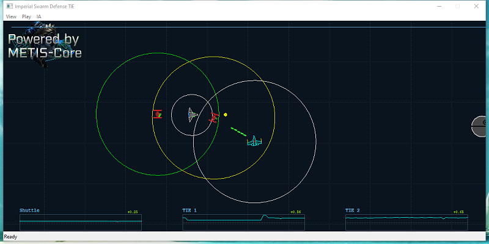

# Tutorial: How to Use Multi-Head Networks with Metis-Core

## Introduction: What is a Multi-Head Architecture in Reinforcement Learning?

In traditional reinforcement learning (such as a standard DQN), the neural network takes a state vector as input and outputs a single value or action. But what happens when your agent needs to perform **several distinct tasks simultaneously**? 

Furthermore, what if you want **multiple agents to collaborate** to achieve a shared goal? A Multi-Head architecture—where a centralized network processes the environment and branches out into multiple "heads" to dictate simultaneous, independent actions—is a powerful solution. This approach avoids combinatorial explosion and can be applied to vastly different fields:

* **Search & Rescue, Drone Swarms, and Warehouse Automation**
  Imagine training two Imperial TIE Fighters that must escort an Imperial Shuttle traveling from Planet A to the Death Star. The fighters must collaborate seamlessly—maintaining their formation while simultaneously making independent decisions to break off and fire if a Rebel X-Wing gets too close.

* **Datacenter Energy Optimization**
  AI agents collaborate to keep server racks cool while minimizing electricity costs. For example, one head of the network might control the HVAC cooling output, another routes network traffic away from overheating servers, and a third puts idle hard drives into sleep mode. They all work together to balance temperature and power usage in real-time.

* **Video Game "AI Directors"**
  Similar to the dynamic difficulty system used in games like *Left 4 Dead*, a Multi-Head network can control the pacing of a game. One head manages enemy spawn rates, another controls loot drops (like ammo and health), and a third adjusts the background music to match the current tension level.

* **Quantitative Trading Bots**
  As demonstrated in academic research like *"DeepScalper: A Risk-Aware Reinforcement Learning Framework to Capture Fleeting Intraday Trading Opportunities"*, a network can use multiple heads to simultaneously decide the trading direction (buy/sell), the position size (how much capital to risk), and the pricing aggressiveness in high-frequency trading.

# Tutorial: Implementing Multi-Head Networks in Metis-Core

## The Imperial Swarm Defense Scenario
To demonstrate how to build and train a Multi-Head neural network using Metis-Core, I have implemented the "Imperial Swarm Defense" example.

**The Mission Context:**
An Imperial Shuttle, carrying a critical shipment of Beskar steel destined for the Death Star, is under fire. A Rebel X-Wings (human in the loop or procedural bot) has intercepted the route, determined to prevent the shuttle from reaching its destination. 

In this scenario, the Imperial Shuttle and its two escorting TIE Fighters learn to collaborate using a Multi-Head architecture. The agents must work in unison to reach the Death Star while effectively defending themselves against incoming Rebel X-Wing attacks.

This scenario serves as the perfect testbed for Multi-Head architectures, as the fighters must balance navigation and formation maintenance (modeled as **dense shaping rewards**) alongside time-critical tactical actions such as firing lasers or deploying decoys (modeled as **event-based rewards**).

# Main Classes.

Metis-Core is completely environment-agnostic. You can easily integrate your own simulation by inheriting from our base classes and overriding the required methods to define your environment's state and reward functions.

### Class `Environment`

The `Environment` class represents the simulated world where the AI agents learn. To integrate your own simulation, you must override the following pure virtual functions:

* `virtual void reset() = 0;`
  Resets the environment state at the start of each training episode.

* `virtual void getState(State* pState) = 0;`
  Fills `pState` with current environment data. This data is utilized for Replay Buffer storage.

* `virtual void serializeState(void* state, std::vector<float>* stateVector) = 0;`
  Serializes environment data into a flat vector. This vector serves as the input for the neural network.

* `virtual void applyAction(IAgent* pAgent, int actionId) = 0;`
  Executes the selected action for the specified agent.

* `virtual float calculateReward(State& state, int* iDone) = 0;`
  Calculates the reward for standard DQN models. 
  *Note: Override this only if using standard DQN; keep it empty for Multi-Head implementations.*

* `virtual std::vector<TMULTIHEAD> calculateRewards(State& state, int* iDone) = 0;`
  Calculates rewards for Multi-Head architectures. Returns a vector of rewards, providing one value per action branch (head).
  
  
  [TODO more clases]